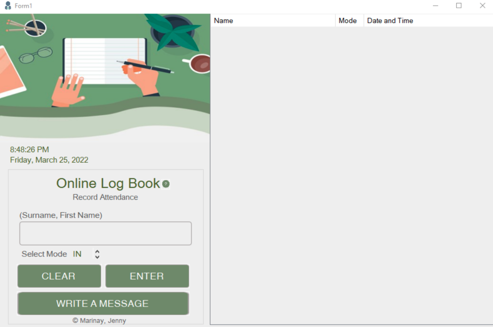
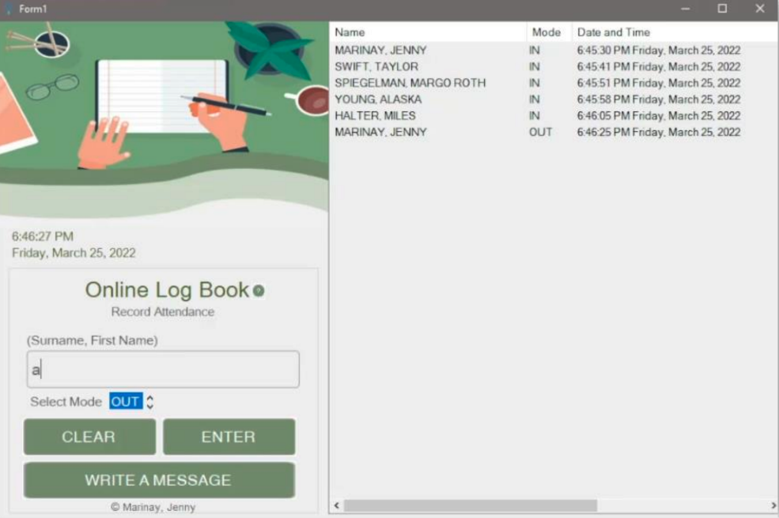
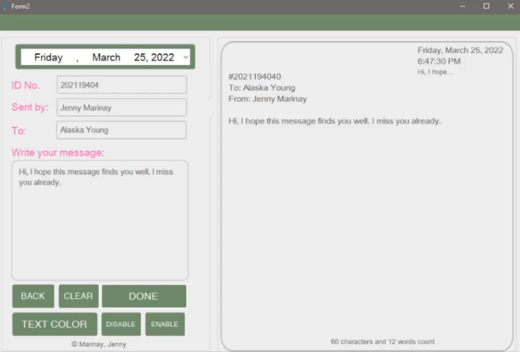

## Logbook And Message Form

This project is a **Logbook and Message Form** application that allows users to enter logs and send messages. It features a simple user interface for logging events and submitting messages, providing an easy way to keep track of entries. ✍️💬

## Features 🌟

- **Real-Time Logbook**: Users can input and record log entries with timestamps, and the data is updated in real-time. 🔄
- **Message Form**: A user interface for submitting messages. 📩

## Weaknesses ⚠️

- **Empty Fields Allowed**: The application currently allows users to enter or record data even when fields are empty. Ideally, the application should prevent submissions with empty fields. 🚫
- **No Log Restrictions**: There are no restrictions preventing users from logging multiple entries if there is already an existing record. The system should ideally restrict multiple log-ins if a record is already present. 🔒
- **Message Form UI Only**: The message form is purely a user interface. Submitted messages can be displayed but cannot be received or stored after submission. ❌📤

---

- ## 🚀 How to Run the Application (Using the Executable File)

1. **Download** the `Marinay - Activity 4.exe` file (located in the `bin/Debug` folder). 📥
2. Open the folder where you downloaded the `Marinay - Activity 4.exe` file.
3. **Double-click** the `Marinay - Activity 4.exe` file to launch the application. 
4. Ensure your system meets the following requirements:
   - **Windows OS** 💻
   - **.NET Framework 4.7.2 or higher** installed 🔧

---

## 📸 Demonstration

### 1. Attendance Page


*The attendance page where users can log their attendance records.*

### 2. With Data Page


*The page where logged data is displayed after submission.*

### 3. Message Form


*The message form where users can submit their messages (UI only, with messages displayed but not stored or processed after submission).*

---

## 📁 Folder Structure
- **Executable**: The compiled `.exe` file can be found in the `bin/Debug` folder. 📂
- **Source Code**: The source files are available in the repository for reference and modification. 📂

---

## 🤝 Contributing
Contributions are welcome! If you'd like to contribute:
1. Fork the repository. 🍴
2. Create a new branch for your feature or bug fix:
   ```bash
   git checkout -b feature/YourFeatureName

---

## ⚖️ LICENSE  

MIT License  
Copyright © 2022 Jenny Marinay  
